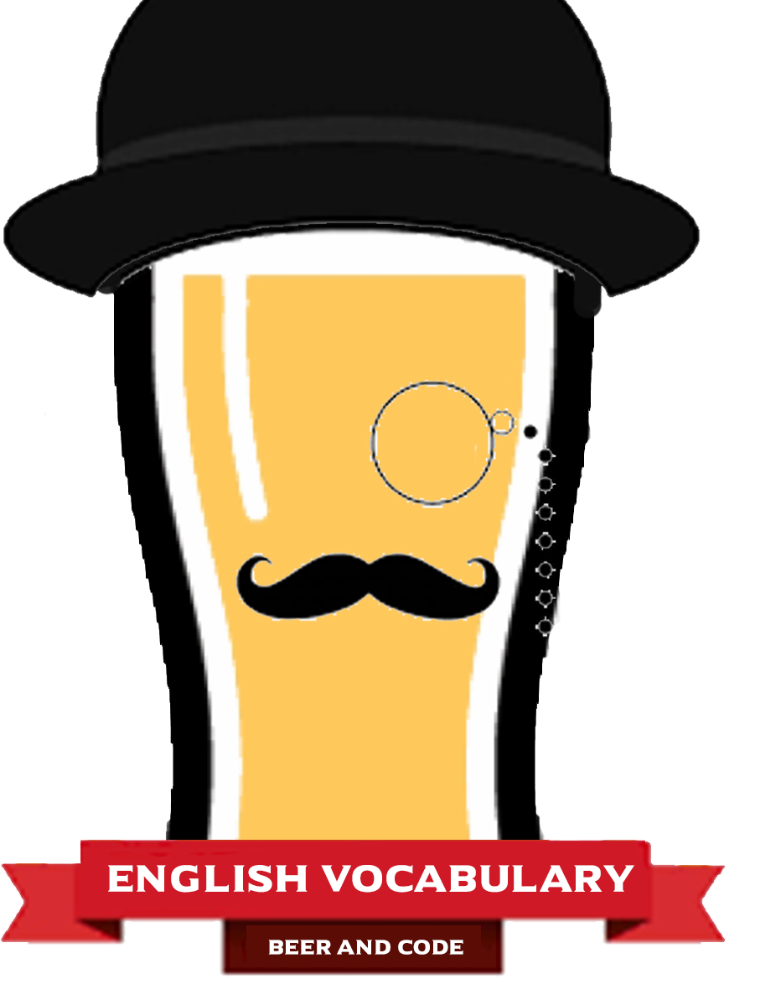

	

  

Bem vindo(a) ao English Vocabulary do Beer & Code!!! 
Aqui você encontra uma lista de palavras e expressões comumente usadas na língua inglesa.
 
Bons estudos!

## List

- [Daily vocabulary](#daily-vocabulary)
- [Business vocabulary](#business-vocabulary)
- [Programming vocabulary](#programming-vocabulary)
- [False friend words](#false-friend-words)

## Daily vocabulary

| Word       | Example                  | Translation                                                                                                         |
| :-------------- | :-------------------- | :------------------------------------------------------------------------------------------------------------------ |
| **Hello** | Hello John!      |  Olá John!         |
| **Best Regards**         | Best regards         | Com os melhores cumprimentos|

## Business vocabulary

WIP

## Programming vocabulary

WIP

## False friend words

| Word       | Example                  | Translation                                                                                                         |
| :-------------- | :-------------------- | :------------------------------------------------------------------------------------------------------------------ |
| **Actually** | Actually, I don't think PHP is dead!      |  Na realidade, eu não acho que PHP morreu!       |
| **Nowdays**         | Nowdays, PHP is very popular.       | Atualmente, o PHP está muito popular.|

 

## Beer and Code

Redes Sociais:
  
✔ Telegram: https://t.me/joinchat/HU7jWfEDn9xzgcND
 
✔ Discord: https://discord.com/invite/mhyKFgv
 
✔ Twitter: https://twitter.com/beerandcodeyt/
​ 
✔ Instagram: https://www.instagram.com/beerandcode_oficial
 
✔ Facebook: https://www.facebook.com/beerandcodeoficial/
 
✔ Spotify: https://open.spotify.com/show/5xGXrAp97Ff9TZYgTYvdhL?si=TimdoZoOQvqzX7FeWHlT-A&nd=1
​ 
✔ Site: https://beerandcode.com.br/ 
 
✔ Linktree: https://linktr.ee/beerandcode​
 

Contato:
✉ contato@beerandcode.com.br

# Observações importantes:

* O nosso trabalho é voluntário.  Somos apaixonados por tecnologia, PHP, Laravel (E cerveja! 🍻🍻🍻). Por isso não podemos oferecer suporte sobre o conteúdo deste repositório. Contamos com a sua curiosidade para desbravar o seu conteúdo da mesma maneira que nós fazemos: estudando a documentação disponível, recorrendo ao Google, Discord, grupos no Telegram e WhatsApp.
